# 머핀 (mufin)

> 삼성 청년 소프트웨어 아카데미(SSAFY) 10기 2학기 특화 프로젝트 (A502)

## ✨ 프로젝트 개요

🏷 **프로젝트 이름 : 머핀(mufin)**

🗓️ **프로젝트 기간 : 2023.02.26 ~ 2024.04.04 (6주)**

👥 **구성원 : 👑윤진아, 윤서안, 장수민, 김라연, 김한슬, 전은평**

---

## 🕶 서비스 구경하기

### [배포 사이트](https://mufin.life)

---

## 🌃 기획 의도

> **'혹시 내가 금융문맹?'**
>
> '금융문맹'이란 문자를 읽고 쓰지 못하는 것을 문맹이라고 하듯이 재화의 소중함과 관리 방식을 몰라 생활에 불편을 주고 삶의 질을 저하시키는 것을 지칭합니다.

대한민국 학생들의 금융이해도 수준이 40점 안팎으로, 국가별 수준의 최하위에 위치하고 있습니다.

이 문제를 해결하기 위해 어린이들을 위한 경제 교육 핀테크 서비스를 개발하였습니다.

---

## 💎 서비스 소개

- 부모님이 계좌를 개설한 후, 아이의 회원가입과 **계좌 개설**을 할 수 있습니다.
- 개설한 계좌에서 서비스의 다른 유효한 계좌로 **송금**할 수 있습니다.
- 부모님과 아이 계정은 서로 **연동**되어 아이들의 **소비 내역을 파악**할 수 있습니다.
- 아이들은 **용돈기입장 기능**을 통해, 소비와 수입을 정리할 수 있습니다.
- **OCR 기능**을 통해 소비한 **영수증을 스캔**하면 소비 내역의 **자세한 내역을 자동으로 등록**할 수 있습니다.
- **부모님**이 **적금 상품**을 **직접 등록**할 수 있습니다.
- 아이들은 부모님이 만든 적금 상품 중 **원하는 상품을 선택**해서 가입할 수 있습니다.
- 아이들이 돈이 필요할 때는, **부모님께 대출 신청**을 할 수 있습니다.
- 대출 신청서에는 **대출의 목적, 금액, 기간, 불입일**의 정보와 **챗봇과의 대화**를 통해, **대출이 정말 필요한지 스스로 판단**할 기회를 제공합니다.
- 대출을 신청하게 되면, 부모님은 **대출 신청서를 심사**할 수 있습니다.
- 대출 심사 결과로 **승인** 또는 **거절**을 선택할 수 있습니다.
- **날씨와 주가를 연동**시켜 **모의 주식 서비스**를 제공합니다.
- 아이들은 주식 차트와 날씨 정보를 기반으로 **주식을 매도**하고, **매수**할 수 있습니다.
- 주식에 투자하지 않는 돈은 **파킹통장에 저축**되어, **안정적**으로 **투자**할 수 있습니다.
- 투자 수익률로 전체 유저 중 **내 순위**와 **전체 랭킹**을 제공하고 있습니다.

---

## 🎯 서비스 대상

- 조기 금융 교육이 필요한 초,중,고등학생과 부모님

---

## 🌈 서비스 화면 소개

| 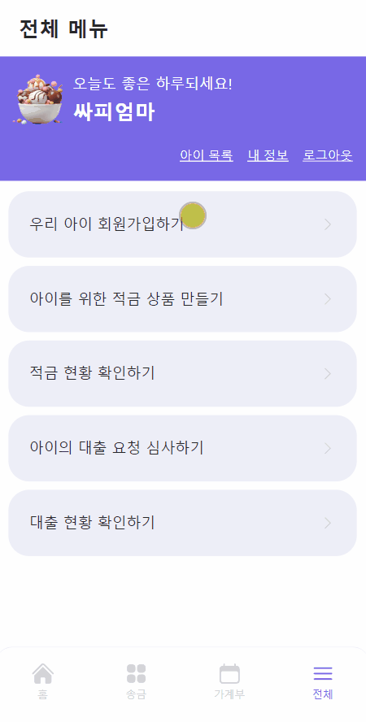 | 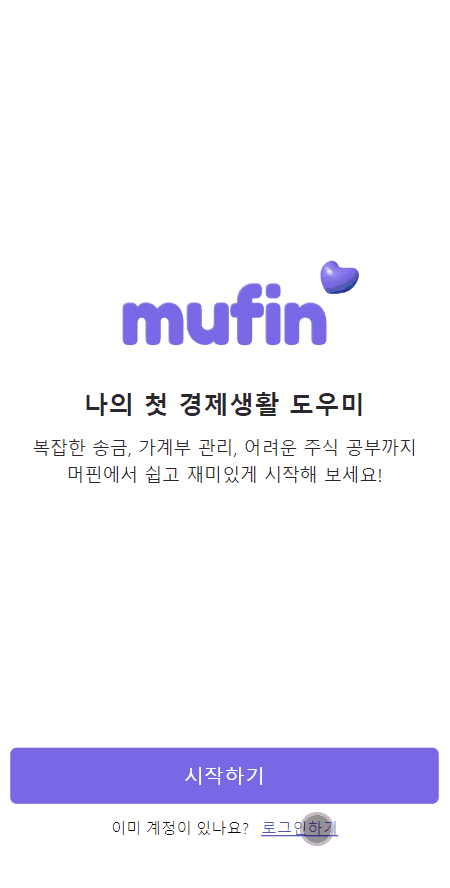 |  |
| :------------------------------------: | :------------------------------------: | :-----------------------------------------: |
|                회원가입                |                 로그인                 |                    송금                     |

| 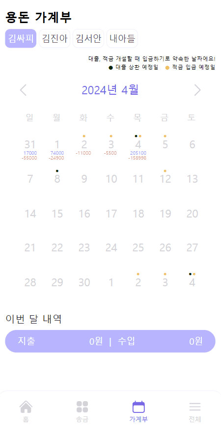 | 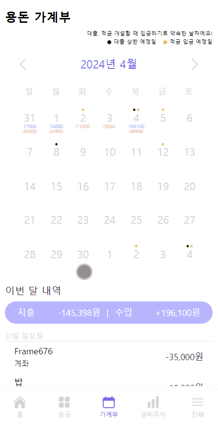 | 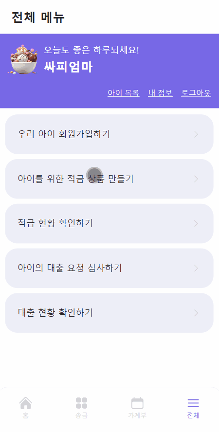 |
| :--------------------------------------------------------------: | :------------------------------------------------------------: | :-------------------------------------------------------: |
|                        가계부(부모님화면)                        |                        가계부(아이화면)                        |                         적금 등록                         |

| 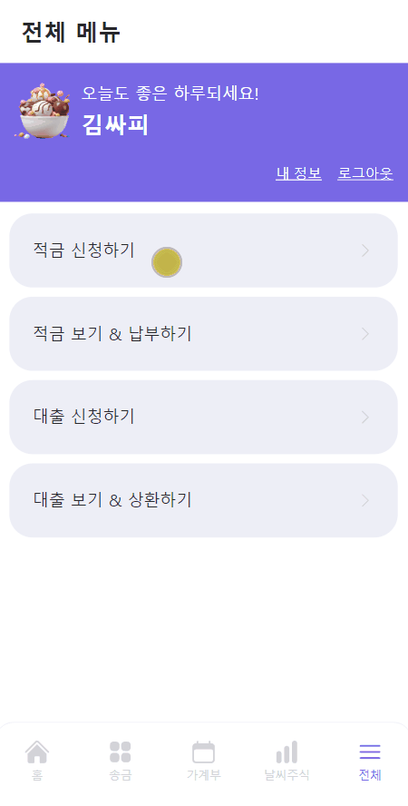 | 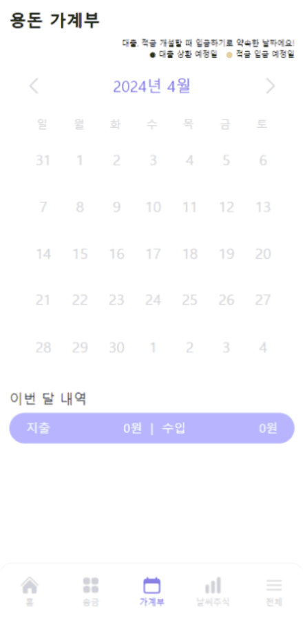 | 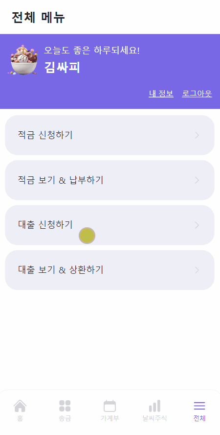 |
| :-------------------------------------------------: | :-----------------------------------------------------: | :-------------------------------------------: |
|                      적금 가입                      |                        적금 불입                        |                   대출 신청                   |

| 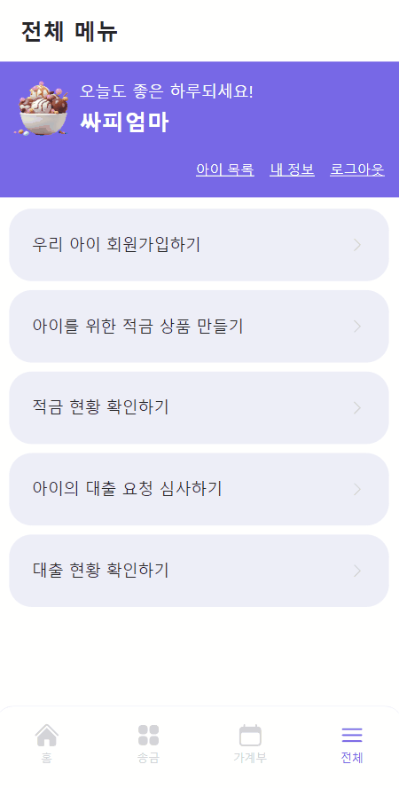 | 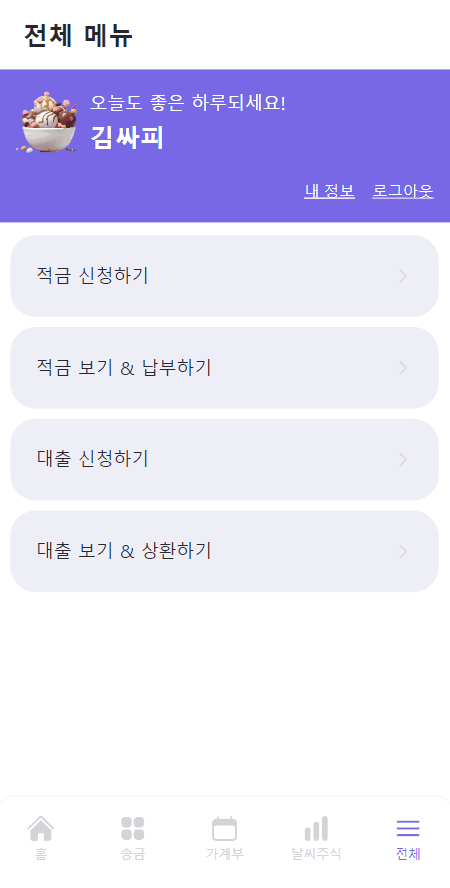 | 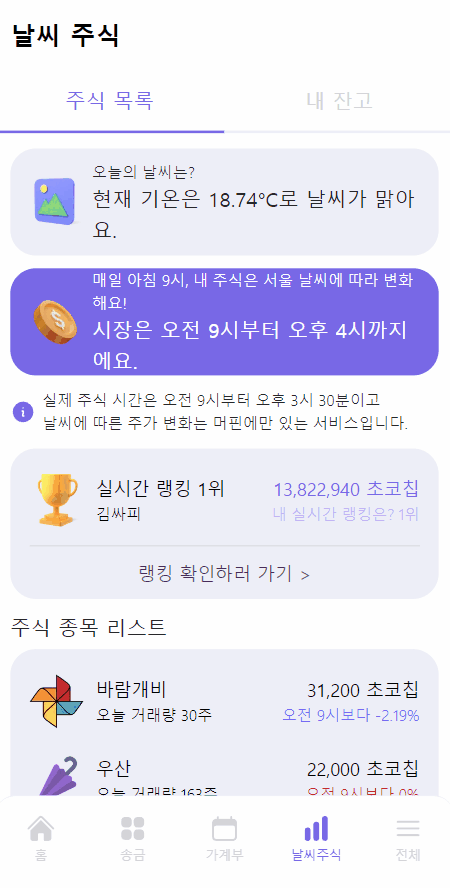 |
| :-----------------------------------------: | :-------------------------------------------: | :---------------------------------------------: |
|                  대출 심사                  |                   대출 내역                   |                    주식 차트                    |

| 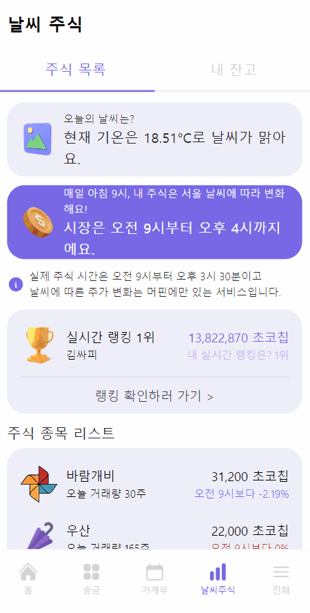 |  |  |
| :-------------------------------------------: | :------------------------------------------: | :-------------------------------------------: |
|                   주식 랭킹                   |                주식 매수 주문                |                주식 매도 주문                 |

---

## 🛠 기술 스택

### Frontend

	
  
	
  
  
  
  
  
  
   

### Backend

	
  
	
	
  

### Database

  
  

### DevOps

  
	
	
	
	

### Communication

	
  
	
	
	

---

## 👨‍👩‍👧‍👦 구성원

|  |  |  |  |  |  |
| :-------------------------------------------------------------------: | :---------------------------------------------------------------------: | :-------------------------------------------------------------------------: | :---------------------------------------------------------------------: | :-------------------------------------------------------------------: | :-------------------------------------------------------------------------: |
|                 [👑윤진아](https://github.com/ahjinU)                 |                  [윤서안](https://github.com/annyoon)                   |                   [장수민](https://github.com/jangsumin)                    |                  [김라연](https://github.com/fkdusrh)                   |                  [김한슬](https://github.com/slcloe)                  |                   [전은평](https://github.com/pyeong114)                    |

---

## 📝 프로젝트 산출물

- [Notion](https://www.notion.so/588744f79b4b48308e66723e188582a4)

### 시스템 아키텍처

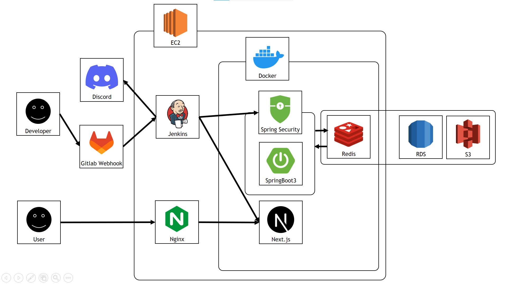

### E-R Diagram

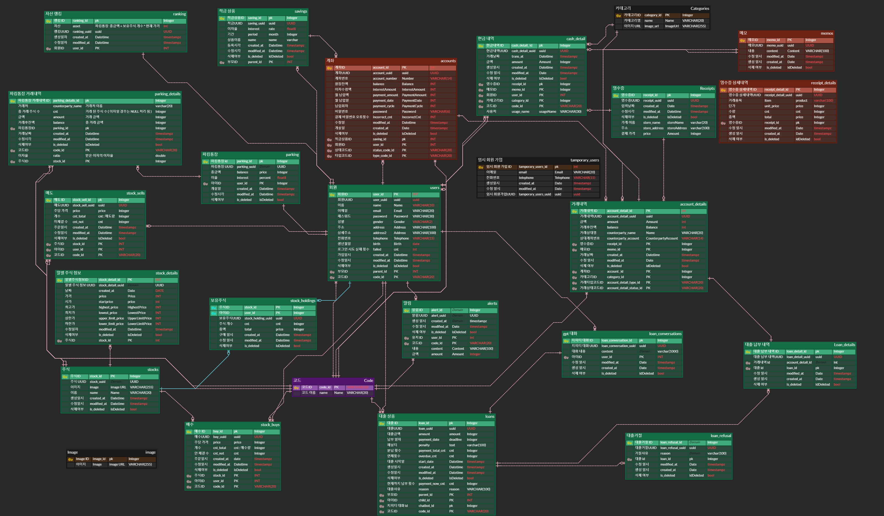

### Figma

